[](https://creativecommons.org/licenses/by/4.0/)
> [!NOTE]
> Current version : **1.0.0** (read [changelog](#changelog) for details)

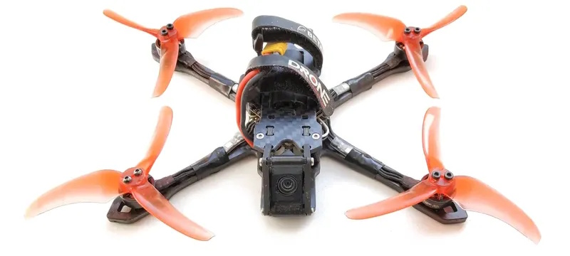

# JeNo Fit 3 and 3.5"
***3 and 3.5" drone FPV frame compatible with Air Unit O4 Lite (or any Nano camera), designed for Freestyle, Freeride, bando and Cinematic.***

> [!NOTE]
> Designed in France by members of the [WE are FPV](https://www.wearefpv.fr/) community, the JeNo is already flown by hundreds of pilots and is now being sold by [Drone FPV Racer](https://www.drone-fpv-racer.com/recherche?controller=search&s=JeNo+5.1+frame&aff=64&id_campaign=13) (affiliate link). The French version of the project is available on [Printables](https://www.printables.com/model/1236372-jeno-fit-335-drone-frame). Note that a [2.5" version](https://github.com/WE-are-FPV/JeNo-Pocket), a [3-3.5" version for O4 Pro](https://github.com/WE-are-FPV/JeNo-3-3.5), a [5.1-6" version](https://github.com/WE-are-FPV/JeNo-5.1) and a [7-8" version](https://github.com/WE-are-FPV/JeNo-7) of the JeNo exist.

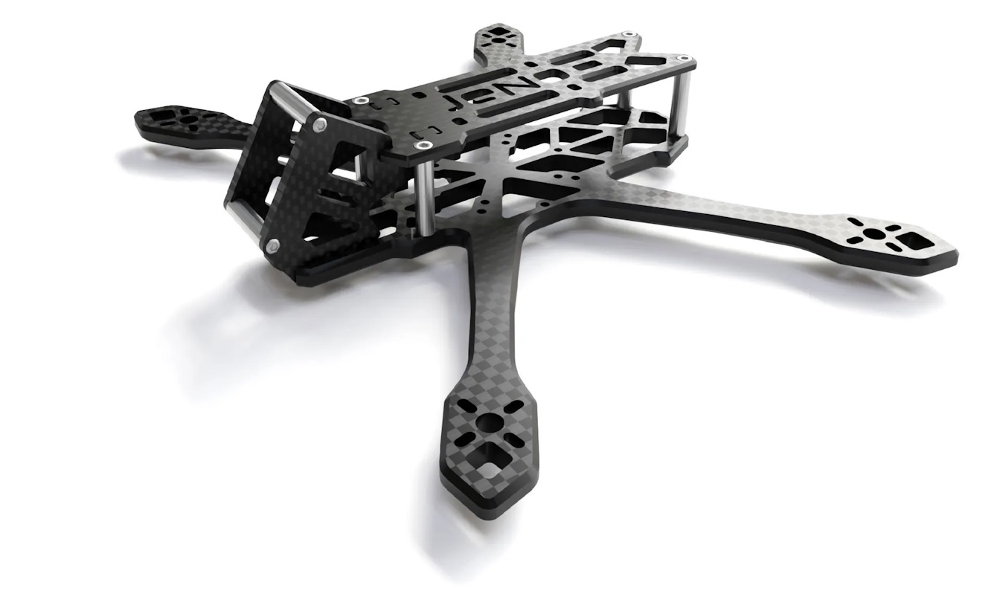

## Table of contents

* [Key features](#key-features)
* [Presentation](#presentation)
* [A frame available in 3 versions](#a-frame-available-in-3-versions)
* [Detailed specifications](#detailed-specifications)
* [Design: 16mm bus height – AIO only](#design-16mm-bus-height-aio-only)
* [Strategy / Motorization / Weight](#strategy-motorization-weight)
* [Blackbox](#blackbox)
* [Sturdiness](#sturdiness)
* [Versions and files](#versions-and-files)
* [Get it cut !](#buy-it-or-cut-it-)
* [Bill of materials](#bill-of-materials)
* [Inspiration](#inspiration)
* [Tuning, Betaflight Preset](#tuning-betaflight-preset)
* [Builds examples](#builds-examples)
* [Authors](#authors)
* [TPU](#tpu)
* [Community (remixes and TPU)](#community-remixes-and-tpu)
* [Changelog](#changelog)

## Key features
- [x] Perfect integration of the **DJI Air Unit O4 Lite camera**
- [x] **Wide-X** geometry
- [x] Excellent flight **performance**, easy to tune
- [x] **Sturdiness/rigidity** with a 4mm bottom plate
- [x] **100% unobstructed FOV**: Frame and standoffs invisible in the video feed
- [x] Designed for: DJI AU O4 Lite, Naked Vista (with Nebula Pro Nano), WalkSnail single board, HDZero single board, Analog
- [x] **Compact**... but not too much...
- [x] Obviously **Open Source**

## Presentation
The **DJI O4 Lite** opens up new possibilities for the 3" format: 100g builds (excluding the lipo) are once again easily achievable, with a shorter, lower, **sleeker**, and stronger frame.

The camera cage of the **JeNo Fit 3"** will therefore be designed for **Nano-sized cameras**, meaning **14mm**. 16mm standoffs slot into 1mm-deep pockets.

Of course, if you want to use an O3 or an O4 Pro, you'll need to stick with the standard [JeNo 3-3.5"](https://github.com/WE-are-FPV/JeNo-3-3.5).

But if you're ready for an O4 Lite, or even a Naked Vista, then this little JeNo Fit 3/3.5 will be much more optimal!

A small comparison between a lightweight JeNo 3" (on the right), and this new JeNo Fit 3" (on the left):
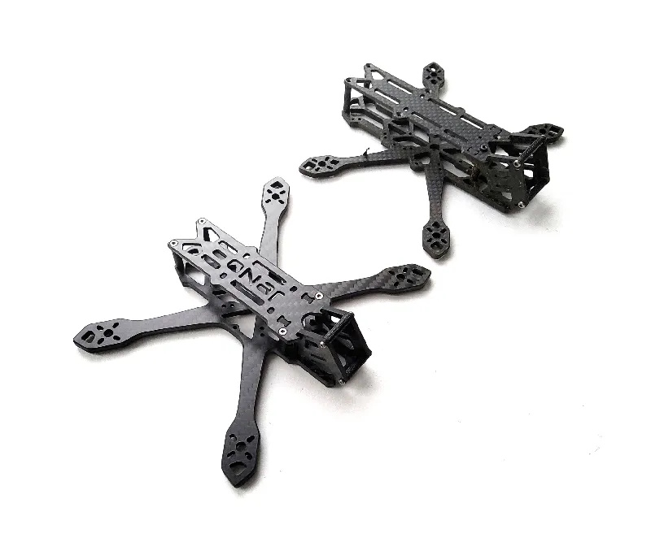

The JeNo is also available in [2.5" version](https://github.com/WE-are-FPV/JeNo-Pocket), [3" and 3.5" versions for O3/O4 Pro](https://github.com/WE-are-FPV/JeNo-3-3.5), [5.1-6" versions](https://github.com/WE-are-FPV/JeNo-5.1) and [7-8" versions](https://github.com/WE-are-FPV/JeNo-7).

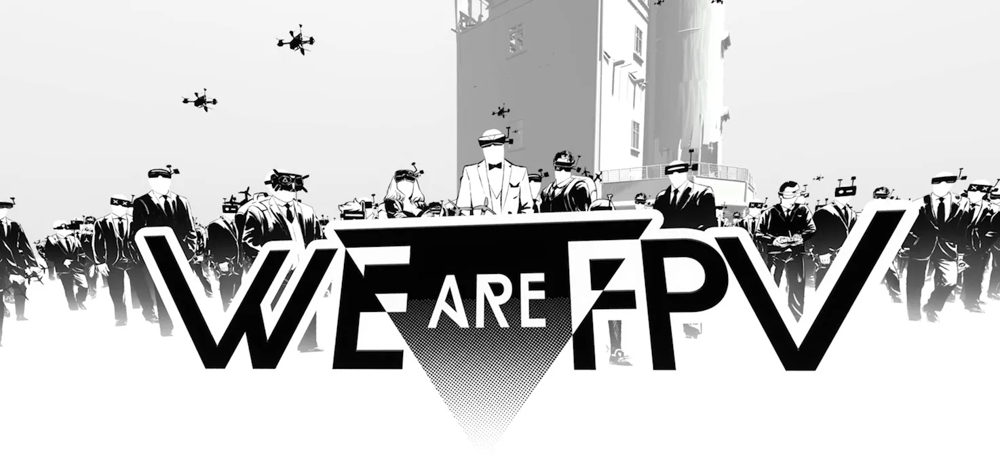

## A frame available in 3 versions
The frame is available in the following versions:

* **3.5" :** 40g with titanium screws
* **3.5" light :** 36g with titanium screws
* **3" :** 38g with titanium screws

At launch, the included **camera plates** are designed for a **30° tilt**. Other camera plates will likely be added soon (25° and 40°).

## Detailed specifications

|||
| :--- | :--- |
| **Geometry** | **Wide-X** | 
| **Props size** | 3 to 3.5" depending on the version | 
| **Weight** | **35 to 40g** depending on the version, with titanium screws | 
| **Body height** | 16 mm M2 | 
| **Bottom plate** | **4 mm** unibody | 
| **Top plate** | 2 mm | 
| **Camera plates** | 2.5 mm | 
| **Motors mounting** | 9-12 mm | 
| **Camera** | 14 mm, Nano, O4 Lite camera. **Clear FOV**. (16mm standoffs recessed) |
| **Main stack** | AiO 25.5 mm x 25.5 mm (M2) and 20 mm x 20 mm (M2) | 
| **Supported VTX** | Analogic, **DJI Air Unit O4 Lite**, WalkSnail, HDZero… | 
| **Strap passage** | Yes | 

## Design: 16mm bus height – AIO only
For the electronics, only AiOs will be accepted. However, they can have the USB port either horizontally or vertically, while keeping the USB port protected.

There will be enough space for an external RX and/or capacitor at the rear and front.

For builds using a Naked Vista, it is recommended to tape the underside of the top plate to prevent short circuits due to contact with the carbon (the build remains relatively tight).

AiO with vertical USB: (AiO rotated 90°)

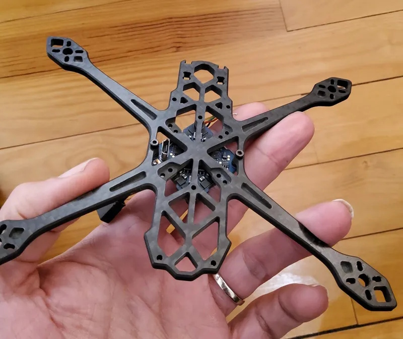

| 3" Naked Vista build | 3.5" O4 "light" build |
| :---: | :---: |
| 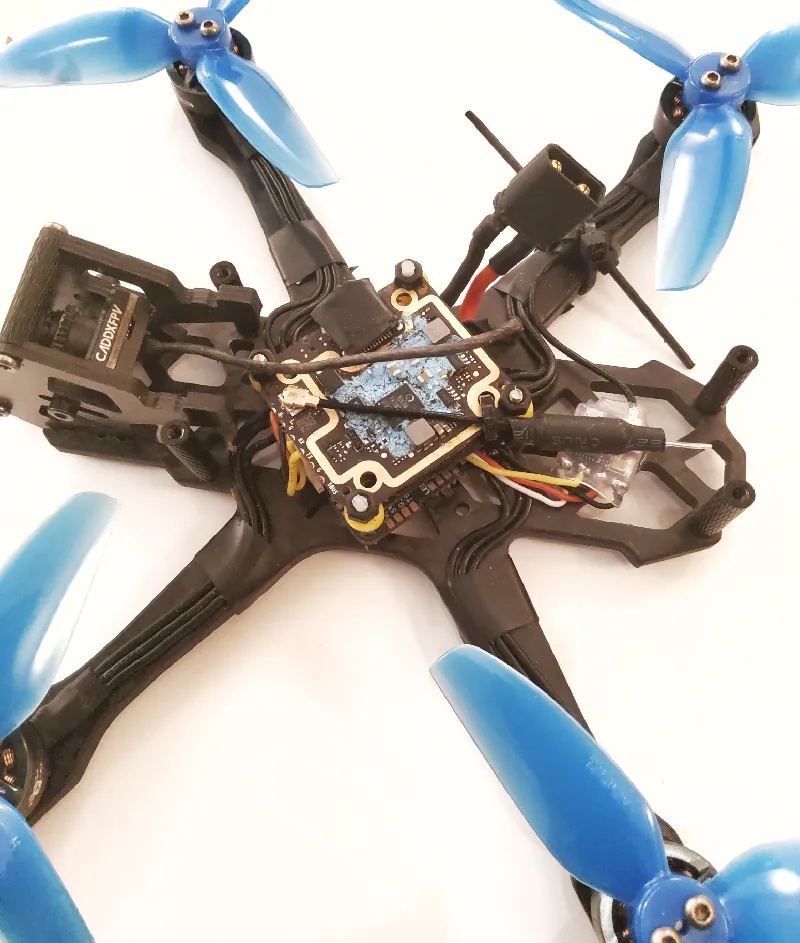 | 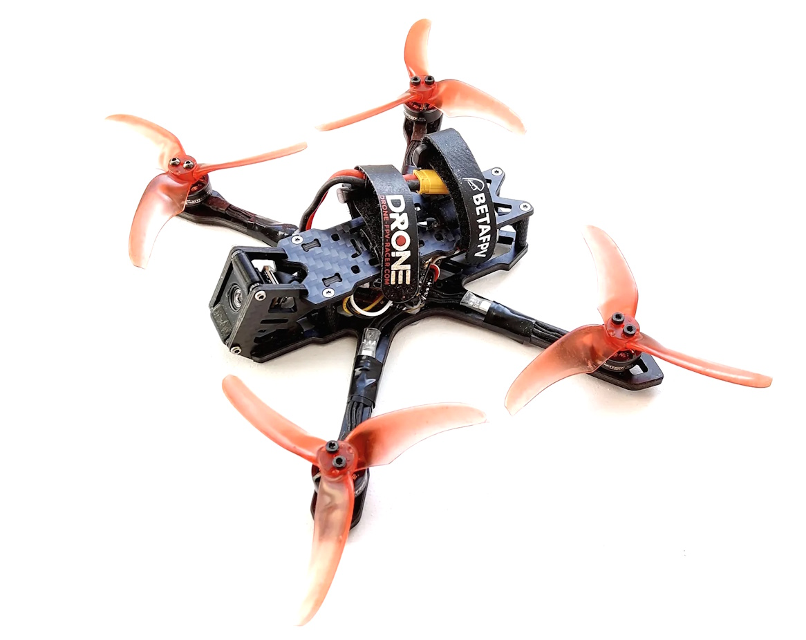 |

## Strategy / Motorization / Weight

Several strategies are available to you:

* **3" or 3.5"**, with a wide range of motor options depending on what you want to achieve: from **1204 to 1604**. This choice will have a significant impact on the build's weight, behavior, and flight time.
* If you're looking for **discretion** while maintaining optimal cruising speed, the 1204 will be perfect in **3.5"**, between **5000 and 6000kv** for **3S**. The sound of the Emax Avan 3528 props will remain discreet at lower RPMs.
* If you're after **punch, the **1604** should be perfect for **4S**.
  * **1604 = 46g** motors
  * **1204 = 24g** motors

| 1204 | 1404 | 1604 |
| :---: | :---: | :---: |
| 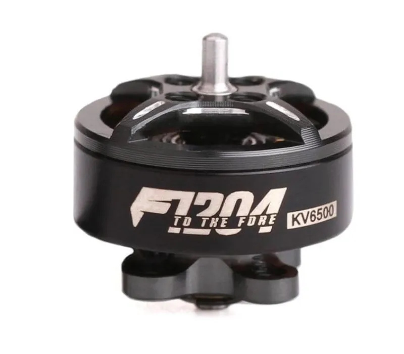 | 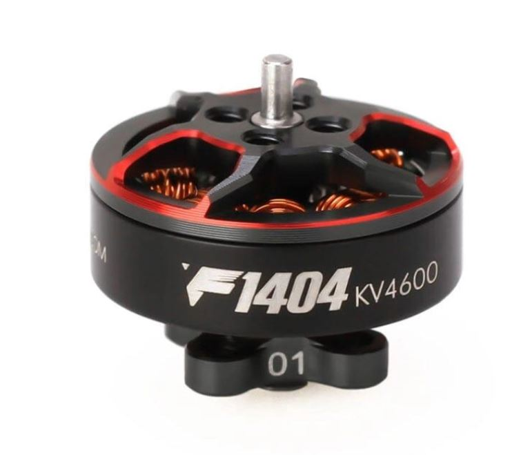 | 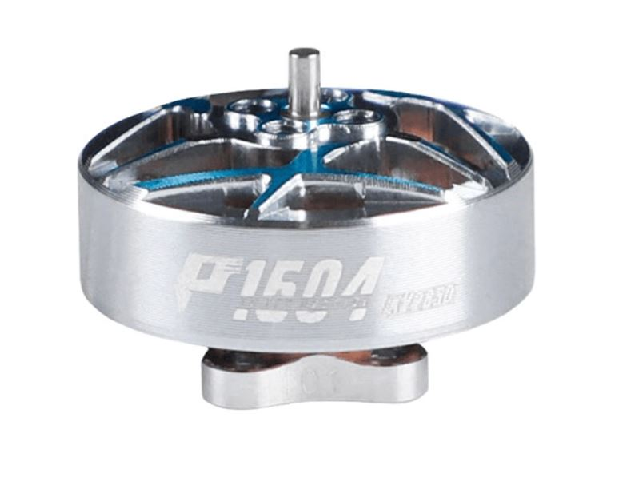 |
| 6.9gr (incl cable) | 9.3gr (incl cable) | 11.6gr (incl cable) |

You will therefore be looking at a build around 95/100g with 1204 motors, versus 122g with 1604 motors.

1204 and Naked Vista build at 99g:
 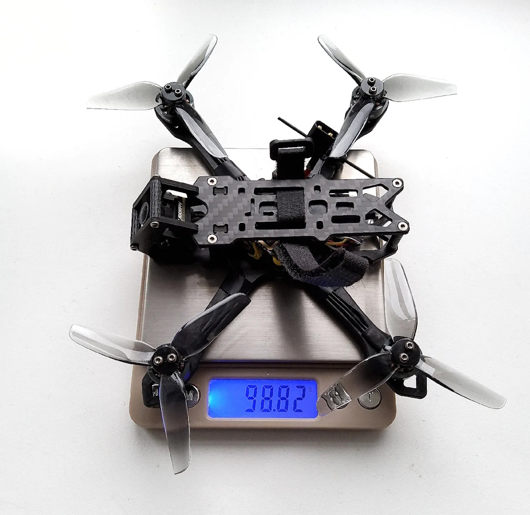 |
 
## Blackbox

The 4mm bottom plate ensures a clean BB.

Here is an excerpt of the BB in 3.5" / 1204:


## Sturdiness
The build is **lighter** than a standard JeNo 3. The **bottom is shorter** but still **4mm** thick, so we’re not concerned about the frame's durability. Remember to grab the arm protection from the [JeNo 3"](https://github.com/WE-are-FPV/JeNo-3-3.5) if you're doing bando.

## Versions and files

### Versioning
You will find the **current version** of the frame at the beginning of the description and the full [history of modifications](#changelog) at the end of the page.

We strongly recommend always cutting the latest version to ensure you benefit from the most recent optimizations.

The version **number format** is as follows :
```
<Major versions>.<Minor version>.<Revision>
ex : 1.3.2
```

* **Revision :** This number is incremented in the case of minor modifications with no significant impact.
* **Minor version :** This number is incremented for minor modifications that may potentially break compatibility with certain TPU parts.
* **Major version :** This number is incremented for significant modifications that break compatibility at the carbon level.

Since the creation of the JeNo 5", we have always strived to **maintain compatibility at the carbon level**. As a result, the version remains “1.x.y.”

**Note :** If you develop TPU parts for the JeNo, be sure to specify the version they are compatible with.

### Files management
To simplify things, we have reorganized the file structure. The files are now divided into **five groups** :

* **01-FRAME :** Contains **models** describing the **frame** in DXF, STEP, and STL formats for the current version. Also contains a PDF file which is a reformatted version of the DXF.
* **02-TPU :** Contains **TPU models** for the current frame version in STL format.
* **03-FRAME-HISTORY :** Contains previous versions of the frame.
* **04-TPU-HISTORY :** Contains TPU models that are no longer compatible with the current version.
* **OTHER-FILES :** Contains documentation files, including the assembly manual and a description.

The major change is that all options are now consolidated into a single file. This will make version management significantly easier for us.

If you want to view the DXF file with all annotations, we recommend using the free software [DWG TrueView](https://www.autodesk.com/products/dwg-trueview/overview). If you prefer not to use it, the PDF version of the file will contain all the necessary information.

## Get it cut !


Unlike the 3 and 5" JeNos, the JeNo Fit won't be available in shops.

The ["01-FRAME"](https://github.com/WE-are-FPV/JeNo-Fit-3-3.5/tree/main/01-FRAME) folder contains all the files you need to get it **cut**. .DXF and .STEP files are available.

## Bill of materials

In addition to the carbon fiber, you will need the following hardware to complete the assembly of the frame.

**Standoffs**

It is recommended to use 5mm diameter standoffs, especially for those that will serve as support for TPU (backpack and capacitor). Moletted spacers can still be used, but the TPU supports will need to be modified accordingly.

| Quantity | Description | Details |
| :---: | :--- | :--- |
| **4** | **M2x16mm** standoffs **(4 mm diameter)** | for the body |
| **2** | **M2x16mm** standoffs **(4 mm diameter)** | for the camera (14mm) |

> [!NOTE]
> The standoffs for the camera plates are recessed by 1mm on each side to standardize the hardware. If you have 14mm standoffs, you can use them by having custom camera plates made without the 1mm pockets.

**Stack materials**

20mm screws will comfortably accommodate most configurations. You can use shorter screws if you prefer.
| Quantity | Description | Details |
| :---: | :--- | :--- |
| **4** | **M2x16/18mm** screws | for the stack |
| **8** | **M2** nylon nuts for the stack screws (4 nuts for the base, 4 nuts on top) | for the stack |

**Frame materials**

| Quantity | Description | Details |
| :---: | :--- | :--- |
| **4** | **M2x6/8mm countersunk screws** (titanium if possible) | for the top plate |
| **8** | **M2x8mm screws** screws (titanium if possible) | for the bottom and camera plates |

**Additional materials**

| Quantity | Description | Details |
| :---: | :--- | :--- |
| **12-16** | **M2x6mm** screws if there is NO arm protection between the screw and the motor, otherwise, **M2x7mm**. To save **weight**, you can use only **3 screws per motor**. | for the motors |

## Inspiration

The **JeNo Fit** is primarily inspired by its bigger brother, the [standard JeNo 3"](https://github.com/WE-are-FPV/JeNo-3-3.5). Like the [JeNo Fit](https://github.com/WE-are-FPV/JeNo-Pocket), it is designed for a Nano-sized camera.

**Gone is the rear stack**, which is no longer needed with the Air Unit O4 Lite. The front, made up of 2 camera plates, was designed around the O4 Lite camera.

## Tuning, Betaflight Preset

**No preset integrated for now.** The behavior of the AiOs can vary quite a bit from one to another. We’ll wait for more feedback.

However, here’s an overview of the first tune used for our test flights, which you can use as a starting point if your **Blackbox is clean enough**. Note that we’ve activated the profile switch based on the number of cells in the lipo.

As always, be very **cautious** when applying these settings.

## Builds examples

You can find several build examples in the Dronebuilds section of the WE are FPV forum:

* [Jeno 3 Low Profil O4](https://forum.wearefpv.fr/topic/24231-jeno-3-low-profil-o4) (by Tooks)

## Authors

The JeNo Fit was designed by :

* nochamo - [Youtube](https://www.youtube.com/user/nochamo)

## TPU

Among the files to download, you’ll find some TPU parts for your JeNo Fit. Initially, these include only the camera/antenna mounts for 4 mm standoffs.

## Community (remixes and TPU)

**Fork/remix**

If something isn't 100% to your liking on the JeNo Fit, feel free to check out the community remixes—you might just find what you're looking for:

**TPU**


## Changelog

> [!TIP]
> Compatibility is consistently maintained between each version: if your frame was a v1, the parts from v1.2 will be compatible. The same applies to TPU accessories. That's why we don't keep the history of previous versions.

* Version **1.0.0** (01/02/2025) :
  * Release of the JeNo Fit

## Join the JeNo family !

|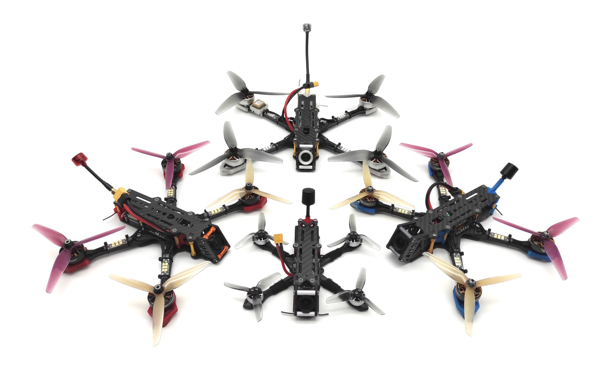|
|:---:|
| JeNo Classic Modus (left), JeNo Cine (right), JeNo 6" (top), JeNo 3" (bottom) |